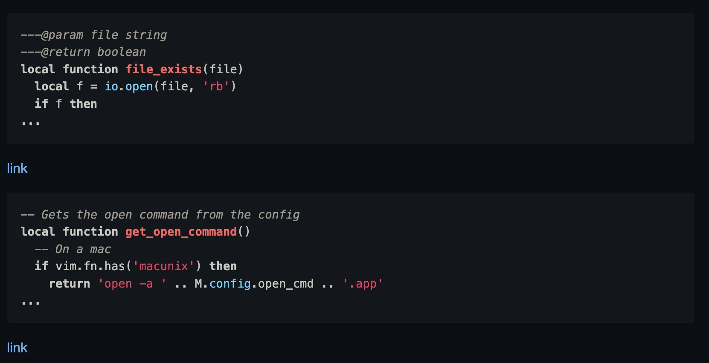

<div align="center">
  <p><strong>Create code snippets in Neovim using <a href="https://ray.so">ray.so</a></strong></p>
</div>

## Requirements

Neovim 0.8+

## Installation

```lua
return {
  'TobinPalmer/rayso.nvim',
  cmd = { 'Rayso' },
  config = function()
    require('rayso').setup {}
  end
}
```

## Configuration

These are the default options, you don't need to copy them into `setup()`

```lua
require('rayso').setup {
  base_url = 'https://ray.so/', -- Default URL
  open_cmd = 'firefox', -- On MacOS, will open with open -a firefox.app. Other OS's are untested.
  options = {
    background = true, -- If the screenshot should have a background.
    dark_mode = true, -- If the screenshot should be in dark mode.
    logging_path = '', -- Path to create a log file in.
    logging_file = 'rayso', -- Name of log file, will be a markdown file, ex rayso.md.
    logging_enabled = false, -- If you enable the logging file.
    padding = 32, -- The default padding that the screenshot will have.
    theme = 'crimson', -- Theme
    title = 'Untitled', -- Default title
  }
}
```

## Log File

The most powerful feature of this plugin is its ability to log snippets in a file, creating a time capsule of snippets
This is an example of a log file. Log files will show the first 5 lines of the snippet, then cut off and show the link to the full snippet.

#### Source

````md
```lua
---@param file string
---@return boolean
local function file_exists(file)
  local f = io.open(file, 'rb')
  if f then
...
```

[link](https://ray.so/#language=lua&theme=midnight&padding=32&code=LS0tQHBhcmFtIGZpbGUgc3RyaW5nCi0tLUByZXR1cm4gYm9vbGVhbgpsb2NhbCBmdW5jdGlvbiBmaWxlX2V4aXN0cyhmaWxlKQogIGxvY2FsIGYgPSBpby5vcGVuKGZpbGUsICdyYicpCiAgaWYgZiB0aGVuCiAgICBmOmNsb3NlKCkKICBlbmQKICByZXR1cm4gZiB%2BPSBuaWwKZW5k&title=Untitled&background=true&darkMode=true&)

```lua
-- Gets the open command from the config
local function get_open_command()
  -- On a mac
  if vim.fn.has('macunix') then
    return 'open -a ' .. M.config.open_cmd .. '.app'
...
```

[link](https://ray.so/#language=lua&theme=midnight&padding=32&code=LS0gR2V0cyB0aGUgb3BlbiBjb21tYW5kIGZyb20gdGhlIGNvbmZpZwpsb2NhbCBmdW5jdGlvbiBnZXRfb3Blbl9jb21tYW5kKCkKICAtLSBPbiBhIG1hYwogIGlmIHZpbS5mbi5oYXMoJ21hY3VuaXgnKSB0aGVuCiAgICByZXR1cm4gJ29wZW4gLWEgJyAuLiBNLmNvbmZpZy5vcGVuX2NtZCAuLiAnLmFwcCcKICBlbmQKCiAgLS0gTm90IGFuIG1hYyBhbmQgY29tbWFuZCBpcyBub3QgYW4gZXhlY3V0YWJsZQogIGlmIHZpbS5mbi5leGVjdXRhYmxlKE0uY29uZmlnLm9wZW5fY21kKSA9PSAwIHRoZW4KICAgIHJldHVybiBlcnJvcignQ291bGQgbm90IGZpbmQgZXhlY3V0YWJsZSBmb3IgJyAuLiBNLmNvbmZpZy5vcGVuX2NtZCkKICBlbmQKCiAgcmV0dXJuIE0uY29uZmlnLm9wZW5fY21kCmVuZA%3D%3D&title=Untitled&background=true&darkMode=true&)
````

#### Rendered Output



## Inspiration

I took some code and major inspiration from [Carbon Now](https://github.com/ellisonleao/carbon-now.nvim)
